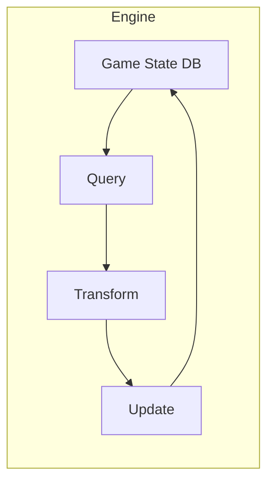
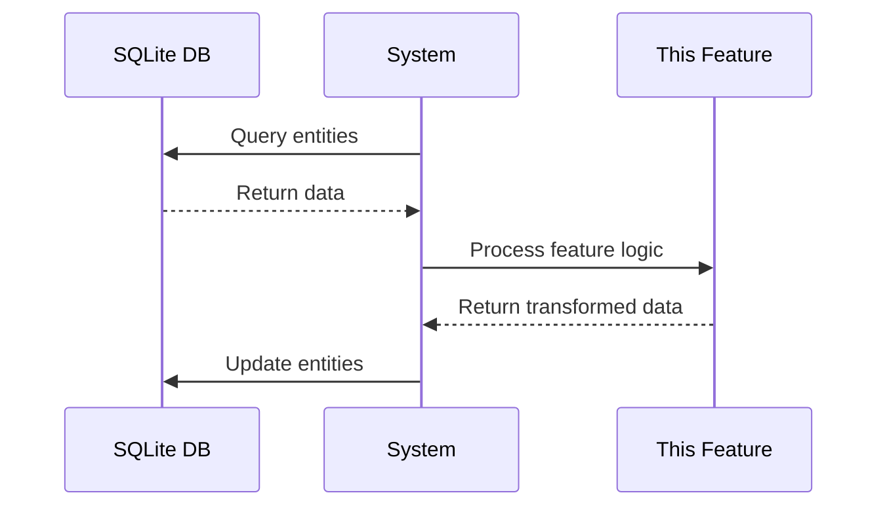

# Feature Name

> **Copy this template when documenting engine features. Delete this note when done.**

<span class="api-stable">Stable API</span> <span class="skill-intermediate">Intermediate Elixir</span>

## Overview

*Brief description of what this engine feature does and when you would use it.*

<div class="prerequisites">

#### Prerequisites
- [Game State](/docs/Engine/state) - Understanding how the SQLite database works
- [Time Step](/docs/Engine/timestep) - How hourly updates function
- Basic Elixir knowledge: [Pattern Matching](https://elixir-lang.org/getting-started/pattern-matching.html)

</div>

---

## Quick Start

```elixir
# Minimal example to get started
defmodule MyMod.Example do
  def hello_world do
    IO.puts("Hello from the engine!")
  end
end
```

---

## Core Concepts

### Concept 1: Name

Explain the concept with a diagram:



### Concept 2: ECS Integration

How this feature relates to Entities, Components, and Systems:

| ECS Element | Role in This Feature |
|-------------|---------------------|
| <span class="ecs-entity">Entity</span> | What entities are involved |
| <span class="ecs-component">Component</span> | What data is stored |
| <span class="ecs-system">System</span> | What transformations occur |

---

## API Reference

### `ModuleName.function_name/2` {#function-name}

<span class="api-stable">Stable</span>

<div class="function-signature">

```elixir
@spec function_name(arg1 :: atom(), arg2 :: map()) :: {:ok, result()} | {:error, reason()}
```

</div>

**Description:** What this function does.

**Parameters:**

<table class="param-table">
<thead>
<tr><th>Name</th><th>Type</th><th>Description</th></tr>
</thead>
<tbody>
<tr><td><code>arg1</code></td><td><code>atom()</code></td><td>Description of first argument</td></tr>
<tr><td><code>arg2</code></td><td><code>map()</code></td><td>Description of second argument</td></tr>
</tbody>
</table>

**Returns:** <span class="return-type">`{:ok, result()}` | `{:error, reason()}`</span>

**Example:**

```elixir
# Basic usage
{:ok, result} = ModuleName.function_name(:my_atom, %{key: "value"})

# With pattern matching
case ModuleName.function_name(:test, %{}) do
  {:ok, data} -> handle_success(data)
  {:error, reason} -> handle_error(reason)
end
```

---

### `ModuleName.experimental_function/1` {#experimental-function}

<span class="api-experimental">Experimental</span>

:::warning Experimental API
This function may change in future versions. Use with caution in production mods.
:::

<div class="function-signature">

```elixir
@spec experimental_function(input :: term()) :: term()
```

</div>

---

## Database Schema

<div class="schema-box">

#### Table: `feature_table`

| Column | Type | Description |
|--------|------|-------------|
| `id` | `INTEGER PRIMARY KEY` | Unique identifier |
| `entity_id` | `INTEGER` | Reference to entity |
| `data` | `TEXT (JSON)` | Serialized component data |
| `updated_at` | `INTEGER` | Hour timestamp of last update |

</div>

**Query Example:**

```sql
SELECT * FROM feature_table 
WHERE entity_id = ? 
ORDER BY updated_at DESC;
```

**Elixir Query:**

```elixir
def get_feature_data(entity_id) do
  Repo.query!(
    "SELECT * FROM feature_table WHERE entity_id = ?",
    [entity_id]
  )
end
```

---

## REST API

The engine exposes this feature via REST endpoints:

<div class="endpoint">
  <span class="endpoint-method method-get">GET</span>
  <code>/api/v1/feature/:id</code>
</div>

Retrieves feature data for a specific entity.

<div class="endpoint">
  <span class="endpoint-method method-post">POST</span>
  <code>/api/v1/feature</code>
</div>

Creates a new feature entry.

<div class="endpoint">
  <span class="endpoint-method method-put">PUT</span>
  <code>/api/v1/feature/:id</code>
</div>

Updates an existing feature entry.

<div class="endpoint">
  <span class="endpoint-method method-delete">DELETE</span>
  <code>/api/v1/feature/:id</code>
</div>

Removes a feature entry.

---

## Pipeline Integration

This feature integrates into the hourly update pipeline:

<div class="pipeline-step">1️⃣ <strong>Read</strong> - Query current state from database</div>
<div class="pipeline-arrow">↓</div>
<div class="pipeline-step">2️⃣ <strong>Transform</strong> - Apply this feature's logic</div>
<div class="pipeline-arrow">↓</div>
<div class="pipeline-step">3️⃣ <strong>Write</strong> - Persist updated state</div>



---

## Modding Guide

### Adding Custom Behavior

```elixir
defmodule MyMod.CustomFeature do
  @moduledoc """
  Example mod that extends the base feature.
  """
  
  alias Engine.Feature
  
  def my_custom_logic(entity_id) do
    # Get existing data
    {:ok, data} = Feature.get(entity_id)
    
    # Apply custom transformation
    updated = Map.put(data, :custom_field, "my_value")
    
    # Save back
    Feature.update(entity_id, updated)
  end
end
```

### Registering with the Pipeline

```elixir
# In your mod's initialization
Engine.Pipeline.register(:hourly, &MyMod.CustomFeature.process/1)
```

:::tip Mod Best Practice
Always check if data exists before modifying it. Other mods may have removed or changed entities.
:::

---

## Common Patterns

### Pattern 1: Query and Transform

```elixir
def update_all_entities do
  Entity.query(has: [:my_component])
  |> Enum.map(&transform/1)
  |> Enum.each(&Entity.update/1)
end
```

### Pattern 2: Conditional Updates

```elixir
def conditional_update(entity) do
  case Entity.get_component(entity, :status) do
    %{active: true} -> apply_active_logic(entity)
    %{active: false} -> entity  # No change
  end
end
```

---

## Troubleshooting

### Issue: Data not persisting

**Symptom:** Changes made in your system don't appear after the next tick.

**Solution:** Ensure you're calling the update function:

```elixir
# ❌ Wrong - just transforms, doesn't save
entity |> transform()

# ✅ Correct - transforms AND saves
entity |> transform() |> Entity.update()
```

### Issue: Query returns empty

**Symptom:** `Entity.query/1` returns `[]` even though entities exist.

**Solution:** Check your component filter matches exactly:

```elixir
# Make sure the component name matches what's registered
Entity.query(has: [:my_component])  # Check spelling!
```

---

## Performance Considerations

| Operation | Complexity | Notes |
|-----------|------------|-------|
| Single entity lookup | O(1) | Uses indexed primary key |
| Query by component | O(n) | Scans component table |
| Bulk update | O(n) | Use transactions for large batches |

:::warning Large Datasets
For operations on 10,000+ entities, consider batching updates to avoid blocking the hourly tick.
:::

---

## Related

- [Game State](/docs/Engine/state) - How the database works
- [Shared Context](/docs/Engine/shared-context) - ECS architecture
- [Time Step](/docs/Engine/timestep) - Update cycle
- [Create Your First Mod](/docs/Engine/create-your-first-mod) - Getting started

---

## Changelog

| Version | Changes |
|---------|---------|
| v0.3 | Added REST API endpoints |
| v0.2 | Improved query performance |
| v0.1 | Initial implementation |
