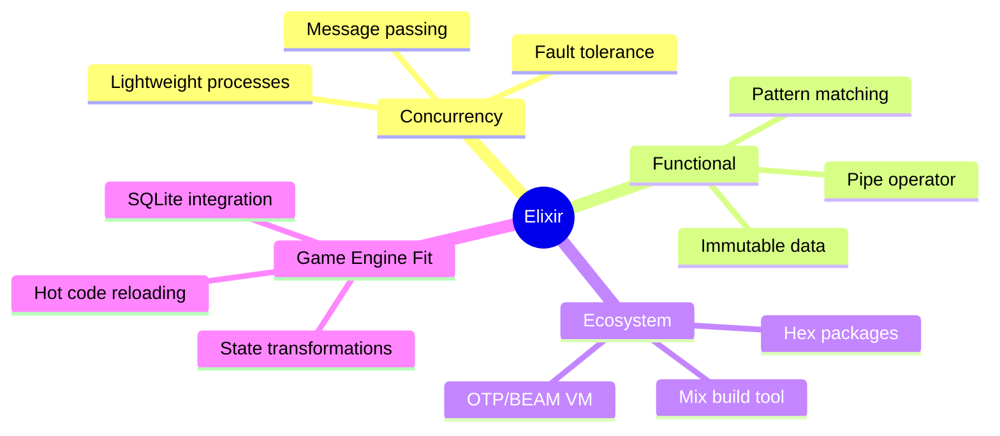
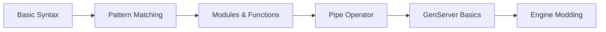

# Elixir

<span class="api-stable">Core Language</span>

The programming language of choice is [Elixir](https://elixir-lang.org/). Many things in the engine category will relate to Elixir and feature Elixir code.

## Why Elixir?



## Skill Level Guide

Documentation pages indicate the required Elixir knowledge:

| Badge                                                | Meaning                                  |
| ---------------------------------------------------- | ---------------------------------------- |
| <span class="skill-beginner">Beginner</span>         | Basic syntax, simple functions           |
| <span class="skill-intermediate">Intermediate</span> | Pattern matching, modules, GenServer     |
| <span class="skill-advanced">Advanced</span>         | Macros, OTP supervision, metaprogramming |

## Essential Elixir Concepts

<div class="prerequisites">

#### Before You Start

These concepts are fundamental to understanding the engine:

-   [Pattern Matching](https://elixir-lang.org/getting-started/pattern-matching.html)
-   [Pipe Operator](https://elixir-lang.org/getting-started/enumerables-and-streams.html#the-pipe-operator)
-   [Modules and Functions](https://elixir-lang.org/getting-started/modules-and-functions.html)

</div>

### Pattern Matching

Used extensively for handling game state:

```elixir
# Matching on function arguments
def handle_event(%{type: :combat, attacker: attacker, defender: defender}) do
  calculate_damage(attacker, defender)
end

def handle_event(%{type: :trade, from: from, to: to, goods: goods}) do
  transfer_goods(from, to, goods)
end
```

### Pipe Operator

Perfect for data transformation pipelines:

```elixir
entity
|> Entity.get_component(:economy)
|> calculate_income()
|> apply_taxes()
|> Entity.update_component(:economy)
```

### Immutability

All game state transformations return new data:

```elixir
# State is never mutated, always transformed
new_state =
  old_state
  |> update_population()
  |> update_resources()
  |> update_diplomacy()
```

## Learning Path



## Quick Reference

### Common Types in the Engine

```elixir
@type entity_id :: integer()
@type component :: atom()
@type game_hour :: integer()
@type result :: {:ok, term()} | {:error, term()}
```

### Frequently Used Functions

<div class="module-ref">

**Entity Module** - `Engine.Entity`

```elixir
Entity.create(components)      # Create new entity
Entity.get(id)                 # Fetch entity by ID
Entity.update(id, changes)     # Update entity
Entity.query(has: [:component]) # Find entities
```

</div>

---

_More complex features will explain required Elixir concepts inline. For comprehensive learning, see the [official Elixir guides](https://elixir-lang.org/getting-started/introduction.html)._
