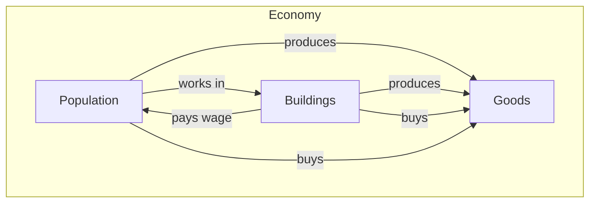
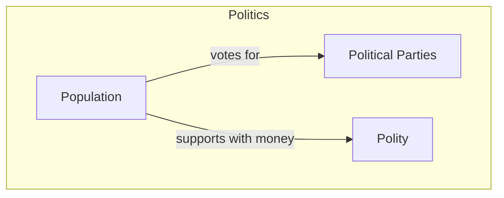
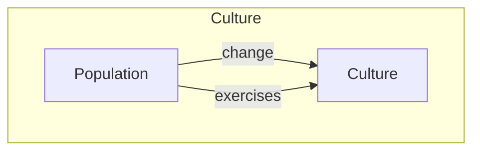
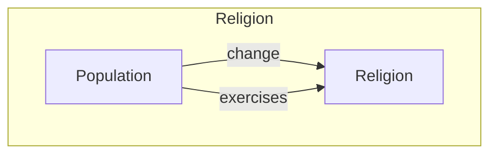
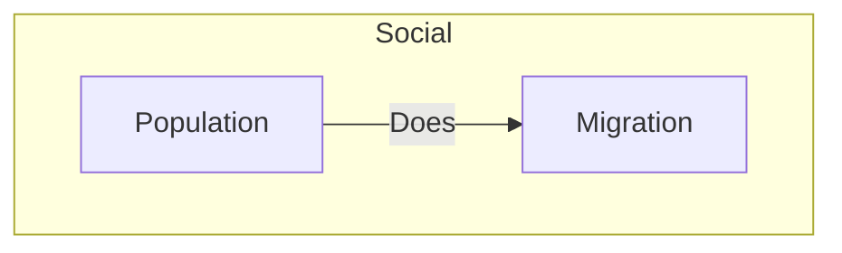

# Population

## Metadata

| Property           | Value                                                                                                                                                  |
| ------------------ | ------------------------------------------------------------------------------------------------------------------------------------------------------ |
| **Status**         | Planned                                                                                                      |
| **Priority**       | High                                                                                                                |
| **Version Target** | v0.1                                                                                                                  |
| **Dependencies**   | [Economy](/docs/Game/economy), [Culture](/docs/Game/Feature/culture), [Religion](/docs/Game/Feature/religion), [Politics](/docs/Game/Feature/politics) |

---

## Overview

:::tip Design Goal
Populations should enable a dynamic world.
:::

---

## Problem Statement

Populations represent a guiding force of a polity, their ideas and ideals push actions. Failing to take care of them may in turn result in them taking action instead. It allows for a dynamic system. Where populations influence the player, but the player can also influence the population.

**Example from Other Games:** In Victoria 2/3, the population system creates a deeper simulation by having to care for a population. Different social classes follow their own goals and ideals. Clashing with each other and often ruling classes guiding a nation.

---

## Proposed Solution

### Core Mechanics

Populations most important characteristics are, their culture, religion and needs for certain goods. First they desire goods for their life needs not to starve, then their religion and culture needs. If they can't live out their ways of life. Their happiness decreases. The more unhappy they become the more willing the get to use more and more radical ways to force a way.

Populations may vote for political parties that aligned with their way of life.

Populations are directly used for military purposes, military units that get completely destroyed results in decreasing population.

It's also important to understand that the different cultures and religion have goods needs to be exercised. So culture and religion of populations also influence what goods they want to buy.

Populations support polity and they in turn will use the support to act on their behalf.

Should life in a location be too miserable, populations will start to migrate.

### System Interactions

---

## Trade-offs

### ✅ Pros

-   Adds meaningful player choices
-   Creates emergent gameplay
-   Integrates with existing systems

### ❌ Cons

-   Increases complexity
-   Requires balancing effort

---

## Design Principles Applied

#### Depth Over Breadth

This feature prioritizes meaningful interactions over many shallow ones. See [Deep Game Mechanics](/docs/Design/deep-game-mechanics).

:::warning Avoid
Don't make this feature feel like busywork. Every interaction should have clear consequences.
:::

:::danger Anti-Pattern
Avoid the "numbers go up" trap where progression feels hollow.
:::

---

## Implementation Phases

### Phase 1: Core Loop v0.2

-   [ ] Basic mechanic implementation
-   [ ] Player-facing UI

### Phase 2: Integration v0.3

-   [ ] Connect to economy system
-   [ ] AI can use the feature

### Phase 3: Polish v0.4

-   [ ] Balance pass
-   [ ] Edge case handling

---

## AI Considerations

:::info AI Parity
Per our [AI design principles](/docs/Game/ai), the AI must be able to use this feature with the same capabilities as players.
:::

How will the AI interact with this feature?

---

## Testing Criteria

| Test Case                     | Expected Result        |
| ----------------------------- | ---------------------- |
| Player uses feature correctly | Desired outcome occurs |
| Edge case: resource at zero   | Graceful handling      |
| AI uses feature               | Same results as player |

---

## Open Questions

-   [ ] What are the performance implications?

---

## Related Documents

-   [Overview](/docs/Design/overview)
-   [Deep Game Mechanics](/docs/Design/deep-game-mechanics)
-   [Balancing](/docs/Design/balancing)

---

## Revision History

| Date       | Author  | Changes       |
| ---------- | ------- | ------------- |
| 2025-12-01 | Ayanami | Initial draft |
