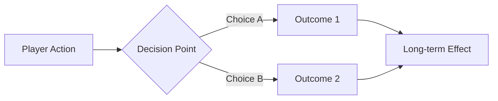
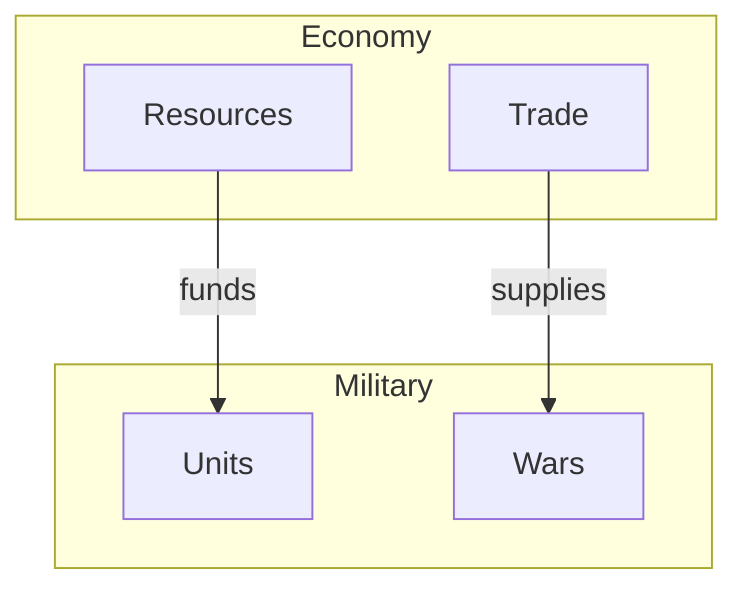

# Religion

## Metadata

| Property           | Value                                                          |
| ------------------ | -------------------------------------------------------------- |
| **Status**         | Planned              |
| **Priority**       | High                        |
| **Version Target** | v0.3                          |
| **Dependencies**   | [Economy](/docs/Game/economy), [Factions](/docs/Game/factions) |

---

## Overview

_One paragraph summary of what this feature is and why it exists._

:::tip Design Goal
State the core design goal this feature serves.
:::

---

## Problem Statement

What problem does this feature solve? Why is it needed?

**Example from Other Games:** In Crusader Kings 3, the stress system creates meaningful consequences for going against your character's personality traits.

---

## Proposed Solution

### Core Mechanics

Describe the mechanics in detail.

### System Interactions

---

## Trade-offs

### ✅ Pros

-   Adds meaningful player choices
-   Creates emergent gameplay
-   Integrates with existing systems

### ❌ Cons

-   Increases complexity
-   May slow down gameplay
-   Requires balancing effort

---

## Design Principles Applied

#### Depth Over Breadth

This feature prioritizes meaningful interactions over many shallow ones. See [Deep Game Mechanics](/docs/Design/deep-game-mechanics).

:::warning Avoid
Don't make this feature feel like busywork. Every interaction should have clear consequences.
:::

:::danger Anti-Pattern
Avoid the "numbers go up" trap where progression feels hollow.
:::

---

## Implementation Phases

### Phase 1: Core Loop v0.2

-   [ ] Basic mechanic implementation
-   [ ] Player-facing UI

### Phase 2: Integration v0.3

-   [ ] Connect to economy system
-   [ ] AI can use the feature

### Phase 3: Polish v0.4

-   [ ] Balance pass
-   [ ] Edge case handling

---

## AI Considerations

:::info AI Parity
Per our [AI design principles](/docs/Game/ai), the AI must be able to use this feature with the same capabilities as players.
:::

How will the AI interact with this feature?

---

## Testing Criteria

| Test Case                     | Expected Result        |
| ----------------------------- | ---------------------- |
| Player uses feature correctly | Desired outcome occurs |
| Edge case: resource at zero   | Graceful handling      |
| AI uses feature               | Same results as player |

---

## Open Questions

-   [ ] How does this interact with multiplayer?
-   [ ] What are the performance implications?
-   [ ] Does this need tutorial coverage?

---

## Related Documents

-   [Overview](/docs/Design/overview)
-   [Deep Game Mechanics](/docs/Design/deep-game-mechanics)
-   [Balancing](/docs/Design/balancing)

---

## Revision History

| Date       | Author    | Changes       |
| ---------- | --------- | ------------- |
| 2025-12-01 | Your Name | Initial draft |
