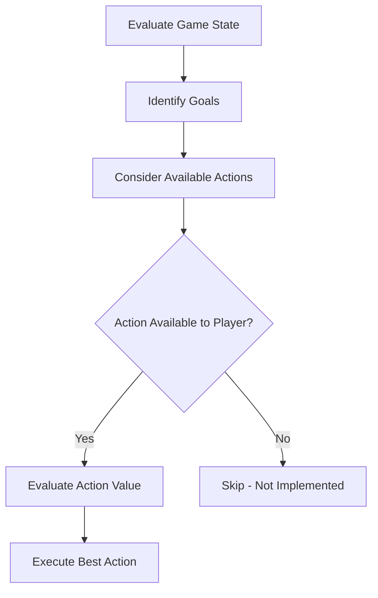

# AI

In Progress

## Core Principle

:::tip Fundamental Rule
The AI can use **any feature** the player can use. There shall not be one feature limited to the player.
:::

This ensures:

-   **Fair gameplay** - Players can't exploit AI limitations
-   **Emergent strategies** - AI can surprise players with creative solutions
-   **System integrity** - Features must be robust enough for AI use

## AI Decision Flow

## Implementation Checklist

When adding any new feature, verify:

-   [ ] AI can detect when to use the feature
-   [ ] AI can evaluate the value of using it
-   [ ] AI can execute the feature correctly
-   [ ] AI handles edge cases gracefully

---

_See also: [AI Design Principles](/docs/Design/AI)_
